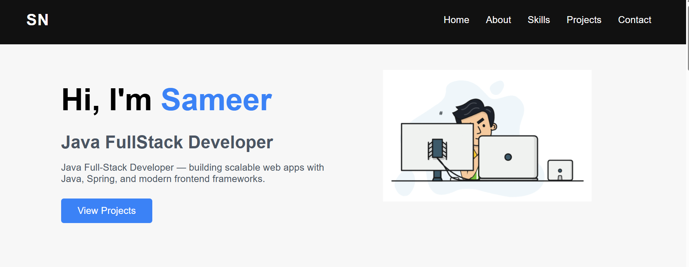
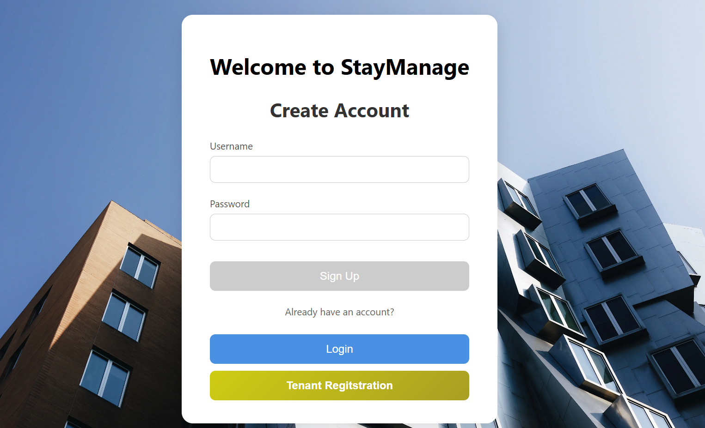
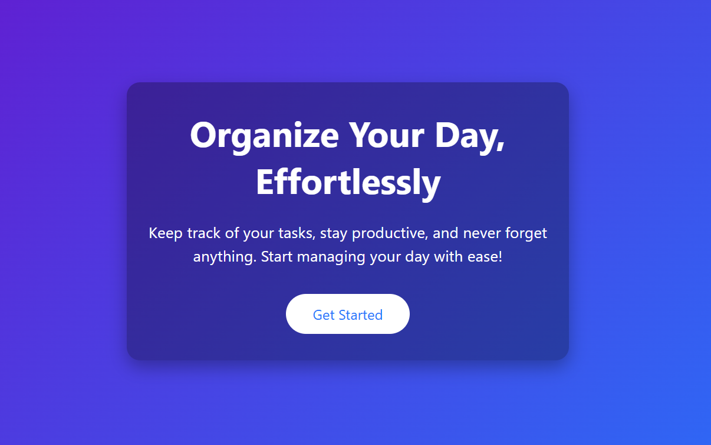
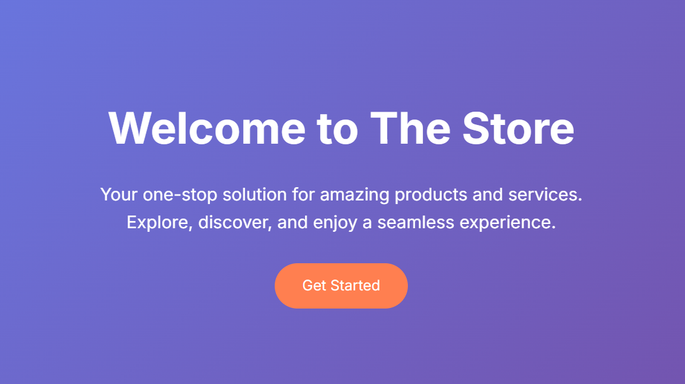

# 👋 Hi, I'm Sameer Nadaf

  

<h3 align="center">🚀 Full Stack Developer | Building Scalable Applications | Passionate About Coding
</h3>

---

## 🧑‍💻 About Me

- 💻 Full Stack Developer with strong frontend fundamentals  
- 🎯 Focused on clean, responsive, and modern UI  
- 🛠️ Believe in building real projects, not just tutorials  
- 📈 Constantly improving through hands-on development  
- 🌱 Currently sharpening JavaScript & backend skills  

---
## 🛠️ Skills & Tools

<table align="center">
  <tr>
    <!-- Frontend -->
    <td align="center" width="120">
       <strong>HTML</strong>
    </td>
    <td align="center" width="120">
       <strong>CSS</strong>
    </td>
    <td align="center" width="120">
       <strong>JavaScript</strong>
    </td>
    <td align="center" width="120">
       <strong>React</strong>
    </td>
    <td align="center" width="120">
       <strong>Angular</strong>
    </td>
  </tr>
  <tr>
    <!-- Backend -->
    <td align="center" width="120">
       <strong>Java</strong>
    </td>
    <td align="center" width="120">
       <strong>Spring</strong>
    </td>
    <td align="center" width="120">
       <strong>Hibernate</strong>
    </td>
    <td align="center" width="120">
       <strong>MySQL</strong>
    </td>
  </tr>
  <tr>
    <!-- Cloud & DevOps -->
    <td align="center" width="120">
       <strong>Docker</strong>
    </td>
    <td align="center" width="120">
       <strong>Kubernetes</strong>
    </td>
    <td align="center" width="120">
      <strong>AWS</strong>
    </td>
    <td align="center" width="120">
       <strong>Kafka</strong>
    </td>
    <td align="center" width="120">
       <strong>Postman</strong>
    </td>
  </tr>
  <tr>
    <!-- Tools -->
    <td align="center" width="120">
       <strong>Git</strong>
    </td>
    <td align="center" width="120">
       <strong>GitHub</strong>
    </td>
    <td align="center" width="120">
       <strong>Spring Security</strong>
    </td>
    <td align="center" width="120">
       <strong>REST API</strong>
    </td>
  </tr>
</table>

---

| Project | Description | Tech & Links |
|---------|-------------|--------------|
|  | **Portfolio 1** Hosted personal portfolio showcasing projects, skills, and contact details. Clean and professional layout. | **Tech:** HTML, CSS, Responsive [🌐 Live Demo](https://sameerm14.github.io/portfolio-training-project/) | [💻 Code](ADD_REPO) |
|  | **Portfolio (CSS & HTML)** Fully responsive portfolio with animations using only HTML and CSS. | **Tech:** HTML, CSS, Angular, Vercel, Responsive, Animations [🌐 Live Demo](https://www.iamsameer.in/) | [💻 Code](ADD_REPO) |
|  | **StayManage (Fullstack)** Fullstack project for property management. Includes backend functionality, database integration, and interactive UI. | **Tech:** HTML, CSS, Angular, java, Springboot, Mysql, Render, Clever Cloud, [🌐 Live Demo](https://staymanagepg-1.onrender.com/) | [💻 Code](ADD_REPO) |
|  | **Samsung Website Clone** Pixel-perfect responsive clone of Samsung’s official website with smooth CSS animations. | **Tech:** HTML, CSS, Responsive, Animations [🌐 Live Demo](https://sameerm14.github.io/samsung-website-clone/) | [💻 Code](ADD_REPO) |
|  | **Todo App** Simple task manager with modern UI, interactive features, and animations. | **Tech:** HTML, CSS, JS [🌐 Live Demo](https://sameerm14.github.io/TodoApp/) | [💻 Code](ADD_REPO) |
|  | **E-commerce UI** Responsive product UI clone with category listing, product cards, and clean layout. | **Tech:** HTML, CSS, JS [🌐 Live Demo](https://sameerm14.github.io/ecommerce-product-ui/) | [💻 Code](ADD_REPO) |

---

## 📊 GitHub Analytics

  
  

  

---

## 🤝 Connect With Me

  
  
  
  
  

---

<b>⚡ Code. Learn. Build. Repeat.</b>

© Created by <b>Sameer Nadaf</b>

